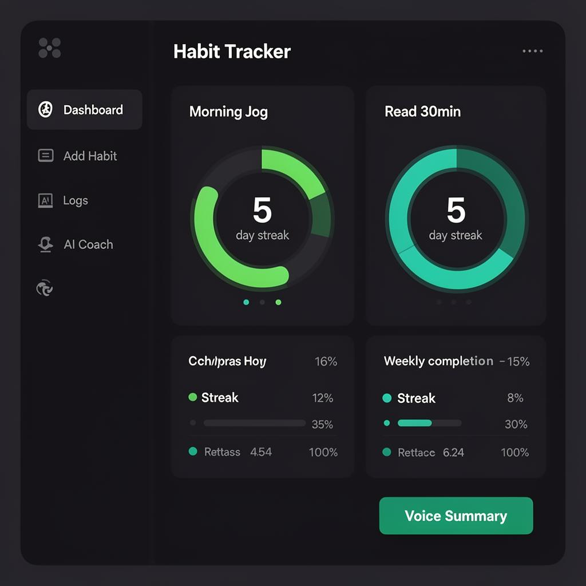
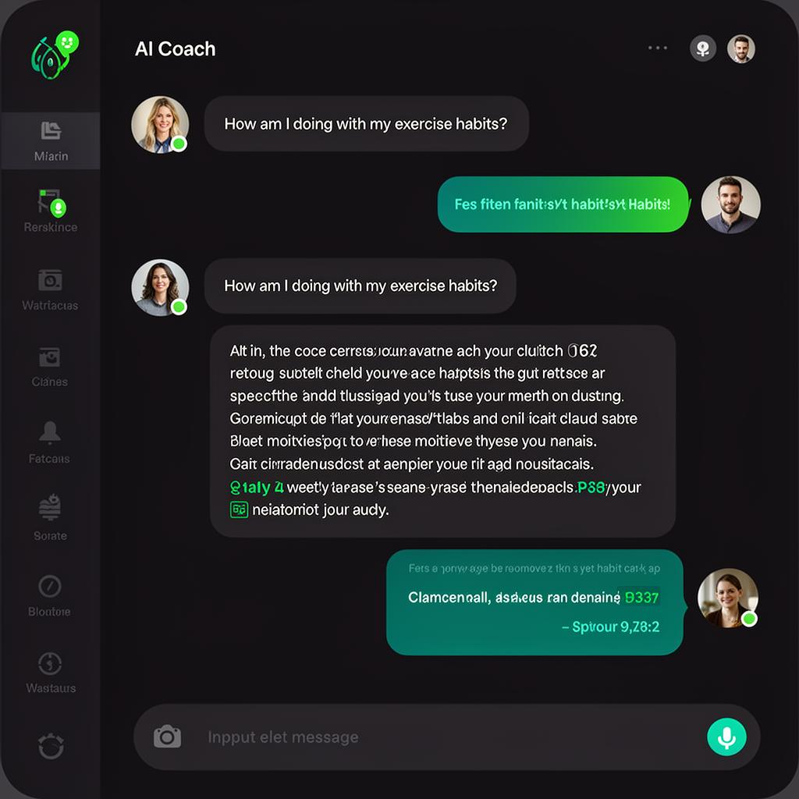
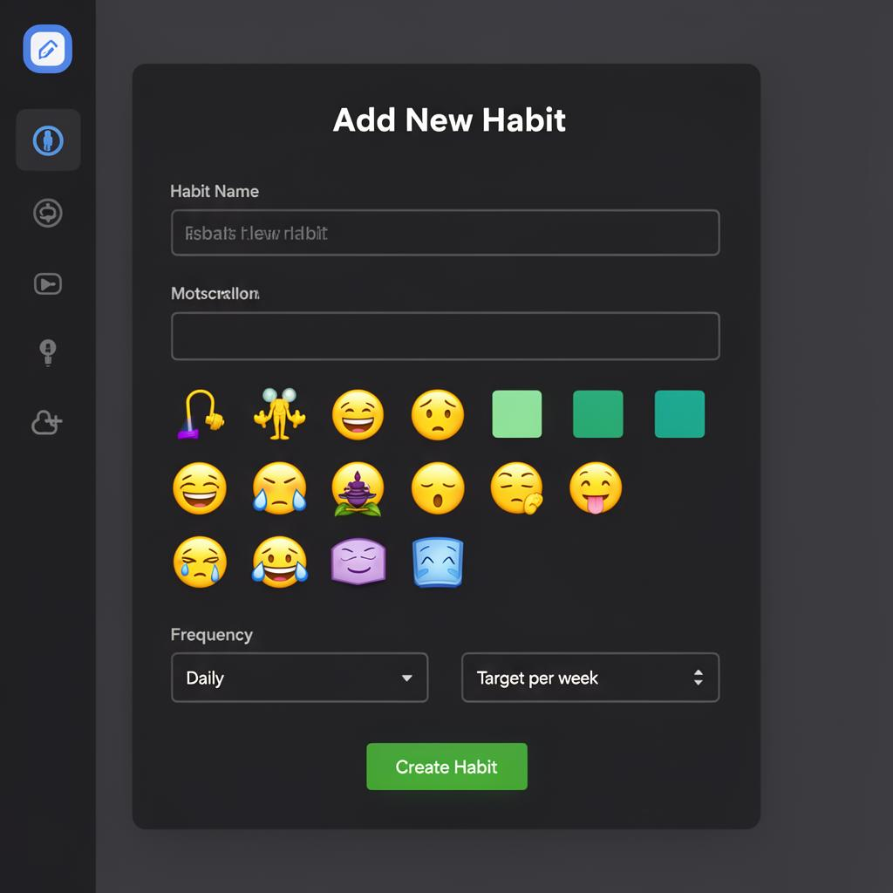

# 🌱 HabitBloom — AI-Powered Habit Tracker

A full-stack habit tracking application with AI coaching, voice summaries, and data-driven insights — built with React, TypeScript, and Supabase.

**[Live Demo →](https://habit-bloom-464.lovable.app)**


---

## ✨ Features

### Core
- **User Authentication** — Email/password signup & login with session management
- **Habit Management** — Create custom habits with color coding, icons, and weekly targets
- **Dashboard** — Real-time progress rings, streak tracking, and weekly completion metrics
- **Habit Logs** — Full history view with filtering and status management
- **Mobile Responsive** — Bottom navigation on mobile, sidebar on desktop

### AI-Powered
- **Habit Coach Chat** — Ask questions about your patterns and get personalized, data-driven advice powered by an LLM (Gemini)
- **Voice Summary** — One-tap weekly summary generated by AI and read aloud via browser Text-to-Speech
- **AI Insights Lab** — Structured report with habit health scoring, risk detection, and experiment-driven recommendations generated from your last 6 weeks of logs

---

## 🛠 Tech Stack

| Layer | Technology |
|-------|-----------|
| **Frontend** | React 18, TypeScript 5, Vite 5 |
| **Styling** | Tailwind CSS 3, shadcn/ui, Radix UI |
| **State** | TanStack React Query |
| **Routing** | React Router v6 |
| **Backend** | Supabase (PostgreSQL, Auth, Edge Functions) |
| **AI** | Google Gemini via Supabase Edge Functions |
| **Charts** | SVG progress rings, Recharts |

---

## 📐 Architecture

```
src/
├── components/       # Reusable UI components (shadcn/ui based)
├── hooks/            # Custom hooks (useAuth, useMobile)
├── integrations/     # Supabase client & auto-generated types
├── pages/
│   ├── Auth.tsx       # Login / Signup
│   ├── Dashboard.tsx  # Metrics, progress rings, voice summary
│   ├── AddHabit.tsx   # Habit creation form
│   ├── HabitLogs.tsx  # Historical log viewer
│   └── HabitChat.tsx  # AI habit coach
└── lib/              # Utilities

supabase/
├── functions/
│   ├── habit-chat/    # AI coaching edge function
│   └── habit-summary/ # Weekly summary edge function
└── migrations/        # Database schema & RLS policies
```

---

## 🔒 Security

- **Row Level Security (RLS)** on all tables — users can only access their own data
- **Auth-gated routes** — all app pages wrapped in `ProtectedRoute`
- **Server-side AI** — habit data is processed in edge functions, never exposed client-side

---

## 🚀 Getting Started

### Prerequisites
- Node.js 18+
- A Supabase project (or use the hosted version)

### Setup

```bash
# Clone the repo
git clone https://github.com/<your-username>/habit-bloom.git
cd habit-bloom

# Install dependencies
npm install

# Create .env with your Supabase credentials
cp .env.example .env
# Fill in VITE_SUPABASE_URL and VITE_SUPABASE_PUBLISHABLE_KEY

# Start dev server
npm run dev
```

### Environment Variables

| Variable | Description |
|----------|-------------|
| `VITE_SUPABASE_URL` | Your Supabase project URL |
| `VITE_SUPABASE_PUBLISHABLE_KEY` | Supabase anon/public key |

---

## 📸 Key Screens

### Dashboard
> Real-time progress rings, streak tracking, weekly completion metrics, and one-tap voice summary.



### AI Habit Coach
> Personalized, data-driven coaching powered by Google Gemini — ask questions about your patterns and get actionable advice.



### Add Habit
> Create custom habits with emoji icons, color coding, frequency settings, and weekly targets.



---

## 🧠 What I Learned

- Designing secure multi-tenant data with Postgres RLS policies
- Integrating LLMs via edge functions with structured prompts grounded in user data
- Building accessible, responsive layouts with Tailwind + shadcn/ui
- Managing async server state with TanStack Query (mutations, invalidation, optimistic updates)

---

## 📄 License

MIT
